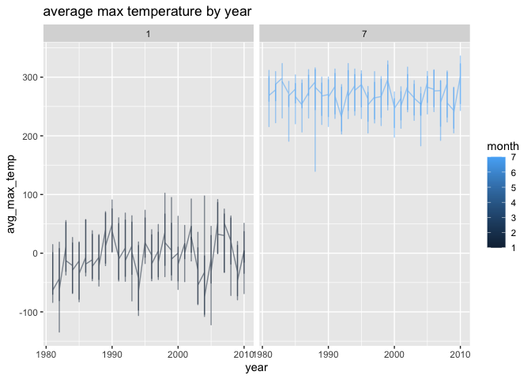
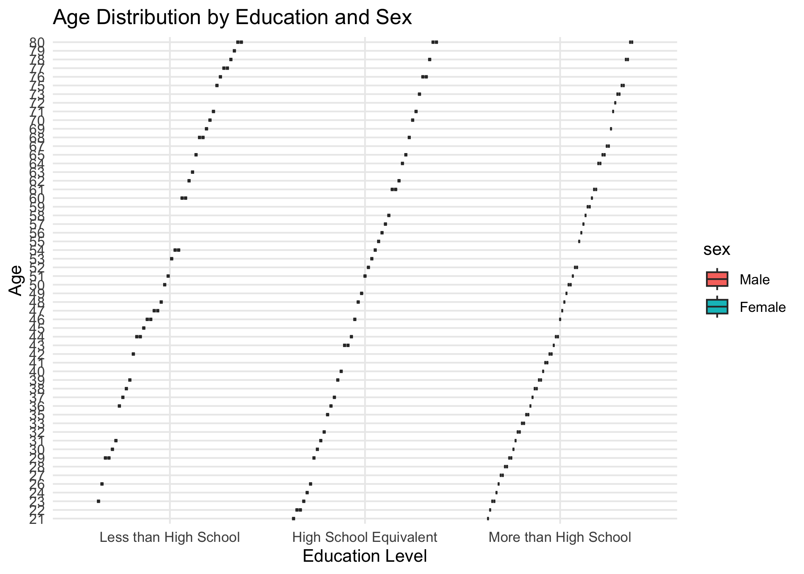
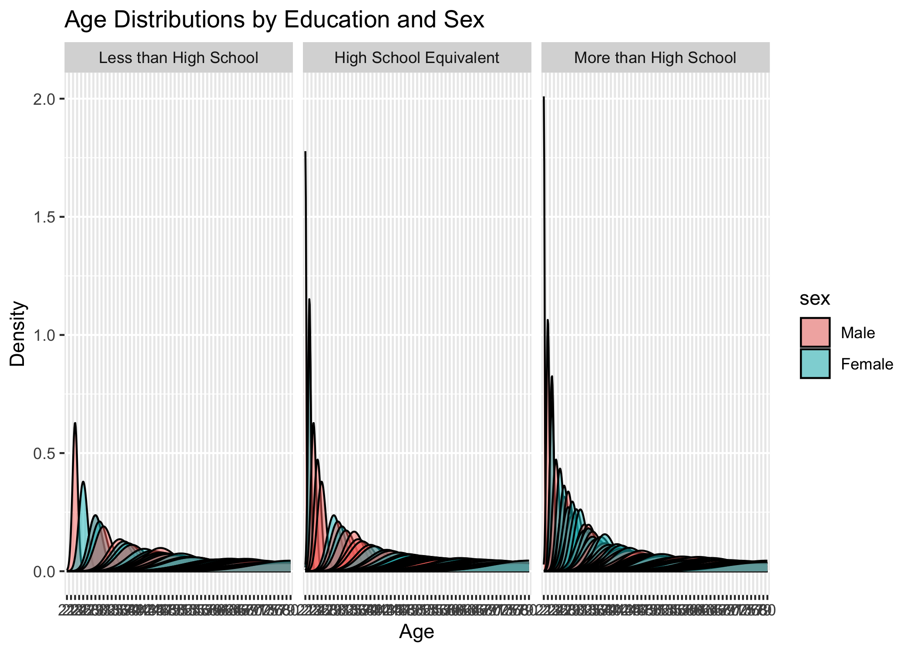
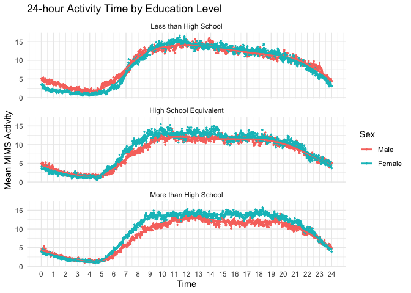
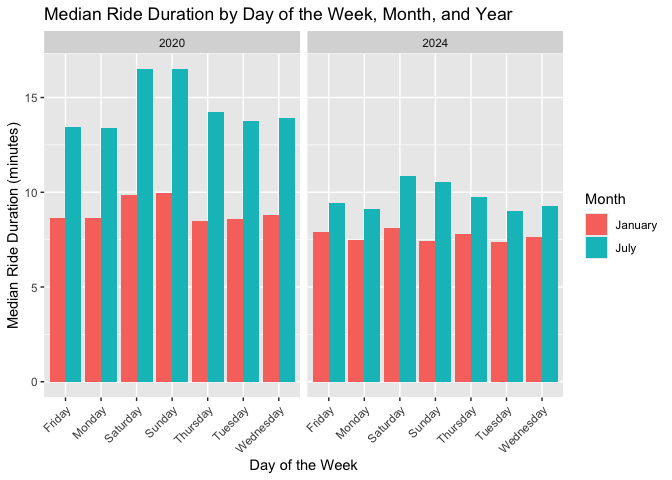
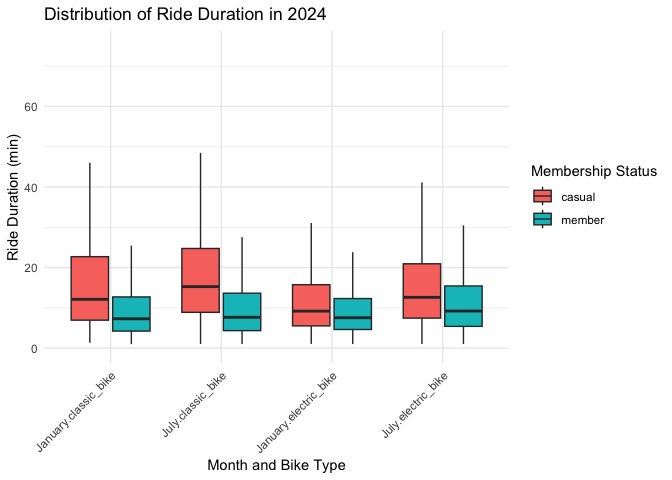

p8105_hw3_nh2796
================
2024-10-16

\##problem 1

``` r
library(p8105.datasets)
data("ny_noaa")

library(tidyverse)
```

    ## ── Attaching core tidyverse packages ──────────────────────── tidyverse 2.0.0 ──
    ## ✔ dplyr     1.1.4     ✔ readr     2.1.5
    ## ✔ forcats   1.0.0     ✔ stringr   1.5.1
    ## ✔ ggplot2   3.5.1     ✔ tibble    3.2.1
    ## ✔ lubridate 1.9.3     ✔ tidyr     1.3.1
    ## ✔ purrr     1.0.2     
    ## ── Conflicts ────────────────────────────────────────── tidyverse_conflicts() ──
    ## ✖ dplyr::filter() masks stats::filter()
    ## ✖ dplyr::lag()    masks stats::lag()
    ## ℹ Use the conflicted package (<http://conflicted.r-lib.org/>) to force all conflicts to become errors

``` r
library(ggplot2)
```

``` r
ny_noaa_df =
  ny_noaa %>%
  mutate(year = year(date),
         month = month(date),
         day = day(date))
```

Some of the key variables here are the precipitation amount, amount of
snowfall, the snow depth, the min and max temperatures. The mean snow
depth was 37.31 and the mean snowfall was 4.98mm

``` r
ny_noaa_summary =
  ny_noaa %>%
  summarise(across(c(prcp, snow, snwd), list(min = min, max = max, mean = mean), na.rm = TRUE))
```

    ## Warning: There was 1 warning in `summarise()`.
    ## ℹ In argument: `across(...)`.
    ## Caused by warning:
    ## ! The `...` argument of `across()` is deprecated as of dplyr 1.1.0.
    ## Supply arguments directly to `.fns` through an anonymous function instead.
    ## 
    ##   # Previously
    ##   across(a:b, mean, na.rm = TRUE)
    ## 
    ##   # Now
    ##   across(a:b, \(x) mean(x, na.rm = TRUE))

snowfall common value

``` r
common_snowfall_value = 
  ny_noaa %>% 
  count(snow) %>% 
  arrange(desc(n))
```

the most common snowfall value in this dataset besides the days that saw
0 snowfall and the days that had missing data, was 25mm which was
observed 38,1221 times.

\##plots

``` r
janjul_data = 
  ny_noaa_df %>% 
  filter(month == 1 | month == 7)

janjul_data$tmax <- as.numeric(as.character(janjul_data$tmax))

avg_temp_data = 
  janjul_data %>%
  filter(!is.na(tmax)) %>% 
  group_by(id, year, month) %>% 
  summarise(avg_max_temp = mean(tmax, na.rm = TRUE)) %>%
  ungroup()
```

    ## `summarise()` has grouped output by 'id', 'year'. You can override using the
    ## `.groups` argument.

``` r
ggplot(avg_temp_data, aes(x = year, y = avg_max_temp, color = month)) +
  geom_line(alpha = .5) +
  facet_grid(. ~ month) +
  labs(title = "average max temperature by year")
```

<!-- -->

\##problem 2

``` r
demographic_data = read_csv(file = "./nhanes_covar.csv", skip = 4)
```

    ## Rows: 250 Columns: 5
    ## ── Column specification ────────────────────────────────────────────────────────
    ## Delimiter: ","
    ## dbl (5): SEQN, sex, age, BMI, education
    ## 
    ## ℹ Use `spec()` to retrieve the full column specification for this data.
    ## ℹ Specify the column types or set `show_col_types = FALSE` to quiet this message.

``` r
accel_data = read_csv(file = "./nhanes_accel.csv")
```

    ## Rows: 250 Columns: 1441
    ## ── Column specification ────────────────────────────────────────────────────────
    ## Delimiter: ","
    ## dbl (1441): SEQN, min1, min2, min3, min4, min5, min6, min7, min8, min9, min1...
    ## 
    ## ℹ Use `spec()` to retrieve the full column specification for this data.
    ## ℹ Specify the column types or set `show_col_types = FALSE` to quiet this message.

\##tidying data

``` r
demographic_data = 
  janitor::clean_names(demographic_data) %>% 
  filter(age >= 21)

accel_data = 
  janitor::clean_names(accel_data)

tidy_accel_data = 
  accel_data %>% 
  pivot_longer(
    cols = starts_with("min"),
    names_to = "Minute",
    values_to = "MIMS"
  )

merged_accel_demo = 
  left_join(demographic_data, tidy_accel_data, by = "seqn") %>% 
  drop_na(age, sex, education) %>% 
  mutate(sex = as.factor(sex),
         education = as.factor(education),
         age = as.factor(age))
```

\##reader friendly table

``` r
merged_accel_demo =
  merged_accel_demo %>% 
  mutate(
    education = recode(education, 
                       `1` = "Less than High School", 
                       `2` = "High School Equivalent", 
                       `3` = "More than High School"),
    sex = recode(sex, 
                 `1` = "Male", 
                 `2` = "Female"))

summary_table =
  merged_accel_demo %>%
  group_by(sex, education) %>%
  summarise(Count = n(), .groups = 'drop') %>%
  arrange(education, sex)

print(summary_table)
```

    ## # A tibble: 6 × 3
    ##   sex    education              Count
    ##   <fct>  <fct>                  <int>
    ## 1 Male   Less than High School  40320
    ## 2 Female Less than High School  41760
    ## 3 Male   High School Equivalent 51840
    ## 4 Female High School Equivalent 33120
    ## 5 Male   More than High School  80640
    ## 6 Female More than High School  84960

This summary table shows some of the demographic characteristics in the
data. We can easily see that more individuals who were both males
(80640) and females (84960)in this dataset reported education of more
than high school, than reporting less than high school or high school
equivalent. There were more males who reported having an education
equivalent to highschool than females.

Age Distribution Visualization

``` r
age_distribution = 
  ggplot(merged_accel_demo, aes(x = education, y = age, fill = sex)) +
  geom_boxplot() +
  labs(title = "Age Distribution by Education and Sex",
       x = "Education Level", y = "Age") +
  theme_minimal()
print(age_distribution)
```

<!-- -->

``` r
age_distribution_density =
  ggplot(merged_accel_demo, aes(x = age, fill = sex)) +
  geom_density(alpha = 0.5) +
  facet_wrap(~ education) +
  labs(title = "Age Distributions by Education and Sex",
       x = "Age", y = "Density") 
  
print(age_distribution_density)
```

<!-- -->
Comments on Age Distribution: I decided to try two different
visualizations for this. I tried a box plot at first and found it to be
really helpful to visualize the median age distributions and how they
differed by each education group. The median age seems to be higher for
females in both the high school equivalent and less than high school
groups, than for the males in those groups. Overall, the median age
seems to be lower for both sexes for the individuals who got more than a
high school education. From the box plot, I can also see that the spread
of ages for all sexes and each education group seems to be very similar
in terms of length. I noticed that when I knitted this, the box plot
that I saw in my rStudio window did not match the image that came up in
the github document. So, I decided to look at a density plot to see if
it looked better. The density plot showed a similar level of variability
in spread, but overall, the box plot gave me more concrete information.

\##Total Activity Data

``` r
total_activity_data =
  merged_accel_demo %>%
  group_by(seqn) %>%
  summarize(total_activity = sum(MIMS, na.rm = TRUE),
            age = first(age), 
            sex = first(sex), 
            education = first(education))

total_activity_plot = 
  ggplot(total_activity_data, aes(x = age, y = total_activity, color = sex)) +
  geom_point() + 
  geom_smooth( se = FALSE) +  
  facet_wrap(~ education) + 
  labs(title = "Total Activity vs Age by Education Level",
       x = "Age",
       y = "Total Activity",
       color = "Sex") 

ggsave("total_activity_plot.png", plot = total_activity_plot, width = 8, height = 6, dpi = 300)  
```

    ## `geom_smooth()` using method = 'loess' and formula = 'y ~ x'

\##comments Comments on total activity plot: Looking at the plot showing
total activity for males and females by education level, one thing that
I have noticed is that the trend lines for males and females in the less
than high school group seem to be more similar to each other compared to
the rather large difference for between male and female total activity
for the high school equivalent group. I also noticed that in the more
than high school education group, the total activity for both males and
females tended to be much closer across the age distribution. On the
other hand, when looking at the less than high school group, the younger
individuals clearly tended to be much more active compared to the older
group. I also thought it was interesting to see that females tended to
be more active than males for the more than high school group, and for
the high school equivalent group across the distribution of ages.
However, for the less than high school group. younger female
participants had higher activity than younger males and older male
participants had higher activity levels than older females.

``` r
merged_accel_demo =
  merged_accel_demo %>%
  mutate(Minute = as.numeric(sub("min", "", Minute)))

time_mims_plot = 
  ggplot(merged_accel_demo, aes(x = Minute, y = MIMS, color = sex)) +
  geom_point(stat = "summary", fun = mean, size = 0.5) +  
  geom_smooth( se = FALSE, size = 1) +  
  facet_wrap(~ education, ncol = 1) +  
  labs(title = "24-hour Activity Time by Education Level",
       x = "Time",
       y = "Mean MIMS Activity",
       color = "Sex") +
  theme_minimal() +
  scale_x_continuous(
    breaks = seq(0, 1440, by = 60),
    labels = seq(0, 24, by = 1)
  )
```

    ## Warning: Using `size` aesthetic for lines was deprecated in ggplot2 3.4.0.
    ## ℹ Please use `linewidth` instead.
    ## This warning is displayed once every 8 hours.
    ## Call `lifecycle::last_lifecycle_warnings()` to see where this warning was
    ## generated.

``` r
print(time_mims_plot)
```

    ## `geom_smooth()` using method = 'gam' and formula = 'y ~ s(x, bs = "cs")'

<!-- -->
\##comments Looking at the plot, it is clear that both sexes represented
in this data set tend to have similar trends in terms of activity levels
throughout a 24 hr day despite education levels. The curves shown in the
plot take on a very similar shape overall for all demographic variables.
It does seem as though females tend to be slightly higher in activity
levels than males during the peak activity time during the 24 hr day for
those who are in the high school equivalent and more than high school
group. The less than high school group seems to be much more similar in
acitivity levels when examining sex.

\##problem 3

``` r
citi_bike_jan2020 = read_csv(file = "./data/Jan 2020 Citi.csv")
```

    ## Rows: 12420 Columns: 7
    ## ── Column specification ────────────────────────────────────────────────────────
    ## Delimiter: ","
    ## chr (6): ride_id, rideable_type, weekdays, start_station_name, end_station_n...
    ## dbl (1): duration
    ## 
    ## ℹ Use `spec()` to retrieve the full column specification for this data.
    ## ℹ Specify the column types or set `show_col_types = FALSE` to quiet this message.

``` r
citi_bike_jul2020 = read_csv(file = "./data/July 2020 Citi.csv")
```

    ## Rows: 21048 Columns: 7
    ## ── Column specification ────────────────────────────────────────────────────────
    ## Delimiter: ","
    ## chr (6): ride_id, rideable_type, weekdays, start_station_name, end_station_n...
    ## dbl (1): duration
    ## 
    ## ℹ Use `spec()` to retrieve the full column specification for this data.
    ## ℹ Specify the column types or set `show_col_types = FALSE` to quiet this message.

``` r
citi_bike_jan2024 = read_csv(file = "./data/Jan 2024 Citi.csv")
```

    ## Rows: 18861 Columns: 7
    ## ── Column specification ────────────────────────────────────────────────────────
    ## Delimiter: ","
    ## chr (6): ride_id, rideable_type, weekdays, start_station_name, end_station_n...
    ## dbl (1): duration
    ## 
    ## ℹ Use `spec()` to retrieve the full column specification for this data.
    ## ℹ Specify the column types or set `show_col_types = FALSE` to quiet this message.

``` r
citi_bike_jul2024 = read_csv(file = "./data/July 2024 Citi.csv")
```

    ## Rows: 47156 Columns: 7
    ## ── Column specification ────────────────────────────────────────────────────────
    ## Delimiter: ","
    ## chr (6): ride_id, rideable_type, weekdays, start_station_name, end_station_n...
    ## dbl (1): duration
    ## 
    ## ℹ Use `spec()` to retrieve the full column specification for this data.
    ## ℹ Specify the column types or set `show_col_types = FALSE` to quiet this message.

``` r
citi_bike_jan2020 =
  janitor::clean_names(citi_bike_jan2020)
citi_bike_jul2020 =
  janitor::clean_names(citi_bike_jul2020)
citi_bike_jan2024 =
  janitor::clean_names(citi_bike_jan2024)
citi_bike_jul2020 =
  janitor::clean_names(citi_bike_jul2020)
```

``` r
citi_bike_jan2020 = 
  citi_bike_jan2020 %>% 
  mutate(month = "January", year = 2020)

citi_bike_jul2020 = 
  citi_bike_jul2020 %>% 
  mutate(month = "July", year = 2020)

citi_bike_jan2024 = 
  citi_bike_jan2024 %>% 
  mutate(month = "January", year = 2024)

citi_bike_jul2024 = 
  citi_bike_jul2024 %>% 
  mutate(month = "July", year = 2024)

view(citi_bike_jan2020)
```

``` r
citi_bike_combined =
  bind_rows(citi_bike_jan2020, citi_bike_jan2024, citi_bike_jul2020, citi_bike_jul2024) %>% drop_na() %>% 
  mutate(duration = as.numeric(duration))

summary(citi_bike_combined)
```

    ##    ride_id          rideable_type        weekdays            duration      
    ##  Length:99253       Length:99253       Length:99253       Min.   :  1.002  
    ##  Class :character   Class :character   Class :character   1st Qu.:  5.587  
    ##  Mode  :character   Mode  :character   Mode  :character   Median :  9.823  
    ##                                                           Mean   : 13.836  
    ##                                                           3rd Qu.: 17.515  
    ##                                                           Max.   :238.780  
    ##  start_station_name end_station_name   member_casual         month          
    ##  Length:99253       Length:99253       Length:99253       Length:99253      
    ##  Class :character   Class :character   Class :character   Class :character  
    ##  Mode  :character   Mode  :character   Mode  :character   Mode  :character  
    ##                                                                             
    ##                                                                             
    ##                                                                             
    ##       year     
    ##  Min.   :2020  
    ##  1st Qu.:2020  
    ##  Median :2024  
    ##  Mean   :2023  
    ##  3rd Qu.:2024  
    ##  Max.   :2024

``` r
descriptive_stats = 
  citi_bike_combined %>%
  group_by(year, month) %>%
  summarize(
    mean_distribution = mean(duration, na.rm = TRUE),
    max_duration = max(duration, na.rm = TRUE), 
    min_duration = min(duration, na.rm = TRUE),
    median_duration = median(duration, na.rm = TRUE),
    count_rides = n()
  )
```

    ## `summarise()` has grouped output by 'year'. You can override using the
    ## `.groups` argument.

``` r
print(descriptive_stats)
```

    ## # A tibble: 4 × 7
    ## # Groups:   year [2]
    ##    year month   mean_distribution max_duration min_duration median_duration
    ##   <dbl> <chr>               <dbl>        <dbl>        <dbl>           <dbl>
    ## 1  2020 January              11.9         231.         1.01            8.87
    ## 2  2020 July                 18.9         239.         1.01           14.6 
    ## 3  2024 January              10.5         226.         1.00            7.66
    ## 4  2024 July                 13.4         232.         1.01            9.59
    ## # ℹ 1 more variable: count_rides <int>

\##description of data

This data shows information about rides taken using citi bike in 2020
and 2024 in the months of january and july. In 2020, July had a higher
number of overall rides at 21013 compared to 12398 rides in January of
2020. In comparison, 2024 saw a hige increase in rides in the summer at
47043 rides in July whereas the number of rides in January of 2024
(18799 rides) were much more similar to that of January 2020. The
maximum and minimum durations for the rides was relatively consistent
across all months and years, with the minimum duration being around 1
minute for each and the max being at around 230 minutes. The median
duration was the highest in July of 2020 at 14 minutes.

\##total rides by member type

``` r
total_rides =
  citi_bike_combined %>%
  group_by(year, month, member_casual) %>%
  summarize(total_rides = n(), .groups = 'drop') %>%
  pivot_wider(names_from = member_casual, values_from = total_rides, values_fill = 0)

print(total_rides)
```

    ## # A tibble: 4 × 4
    ##    year month   casual member
    ##   <dbl> <chr>    <int>  <int>
    ## 1  2020 January    980  11418
    ## 2  2020 July      5625  15388
    ## 3  2024 January   2094  16705
    ## 4  2024 July     10843  36200

From this table, we can see that there are overall more members than
casual riders in this dataset. Casual riders were most prevalent in July
of 2024, however that month there were many more riders overall in the
data set, so the number of members was highest here as well. The numebr
of members was pretty consistent in Jan 2020, July 202, and Jan 2024.

\##july 2024 popular stations

``` r
popular_july_2024 =
  citi_bike_jul2024 %>% 
  group_by(start_station_name) %>% 
  summarize(num_rides = n()) %>% 
  arrange(desc(num_rides)) %>% 
  slice_head(n = 5)

print(popular_july_2024)
```

    ## # A tibble: 5 × 2
    ##   start_station_name       num_rides
    ##   <chr>                        <int>
    ## 1 Pier 61 at Chelsea Piers       163
    ## 2 University Pl & E 14 St        155
    ## 3 W 21 St & 6 Ave                152
    ## 4 West St & Chambers St          150
    ## 5 W 31 St & 7 Ave                146

``` r
median_ride_duration =
  citi_bike_combined %>%
  group_by(year, month, weekdays) %>%
  summarize(median_duration = median(duration), .groups = 'drop')

ggplot(median_ride_duration, aes(x = weekdays, y = median_duration, fill = factor(month))) +
  geom_bar(stat = "identity", position = "dodge") +
  facet_wrap(~ year) + 
  labs(title = "Median Ride Duration by Day of the Week, Month, and Year",
       x = "Day of the Week",
       y = "Median Ride Duration (minutes)",
       fill = "Month") +
  theme(axis.text.x = element_text(angle = 45, hjust = 1))
```

<!-- -->
\##comments on median ride duration plot Looking at the bar chart that I
created examining median ride duration, it is clear that July has
consistently higher ride duration times, but ride durations were much
higher in 2020 compared to 2024. The ride duration for January is pretty
consistent throughout the years. Ride duration was also shown to be
higher on saturdays and sundays for both years in July. However, there
is some variability with this in January.

\##2024 data

``` r
citi_data_2024 <- citi_bike_combined %>% 
  filter(year == 2024)

ggplot(citi_data_2024, aes(x = interaction(month, rideable_type), y = duration, fill = member_casual)) +
  geom_boxplot(outlier.shape = NA) +
  labs(title = "Distribution of Ride Duration in 2024",
       x = "Month and Bike Type",
       y = "Ride Duration (min)",
       fill = "Membership Status") +
  scale_y_continuous(limits = c(0, 75)) +
  theme_minimal() +
  theme(axis.text.x = element_text(angle = 45, hjust = 1))
```

    ## Warning: Removed 381 rows containing non-finite outside the scale range
    ## (`stat_boxplot()`).

<!-- -->
From the box plot that I created showing the distribution of ride
duration in 2024, it is clear that the median ride duration for the
classic bike in both months of 2024 had more variability for casual
riders. The members had a lot less variability in ride duration accross
the board. The median duration for the members was also very consistent
across the different bike types for all of the months presented.
